  
  
   
  <picture>
    <source media="(prefers-color-scheme: dark)" srcset="dist/github-snake-dark.svg" />
    <source media="(prefers-color-scheme: light)" srcset="dist/github-snake.svg" />
    
  </picture>
  
    
  

